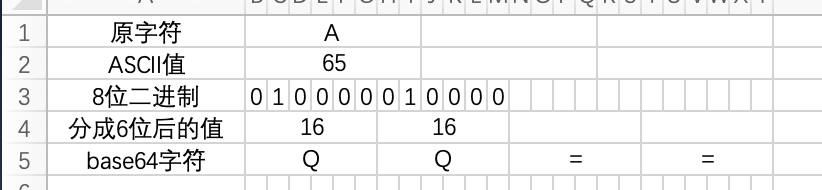

# 手动实现 source-map 中生成 mapping 属性的 base64-VLQ 编码功能

**最近在学习 source-map 的相关知识时，对其 mapping 字段的编码生成过程产生了浓厚的新趣，查阅多方资料后，决定实现自己的 base64、VLQ 以及 base64-VLQ 编码功能。**

> 此文章不涉及 source-map 的知识普及和讲解，只着重讲解三种编码功能的原理及实现。所以需要你有一定的 source-map 相关知识背景，如果需要提前补充知识的，强烈推荐这几篇文章：
>
> - [万字长文：关于 sourcemap，这篇文章就够了](https://juejin.cn/post/6969748500938489892#heading-18)
> - [绝了，没想到一个 source map 居然涉及到那么多知识盲区](https://juejin.cn/post/6963076475020902436)

## base64 编码

### 概念

base64 编码，也就是指用 [0-9a-zA-Z+/] 这 64 个字符以及作为补位的'='共 65 位作为基本字符集，将其他字符**每 3 个一组**，通过各种方式**转换成 4 个**base64 字符的一种编码方式。

### 为什么是这 64 个基本字符？

> 我们知道在计算机中任何数据都是按字节存储的，有的复杂的数据（比如汉字）可能由多个字节表示，简单（比如单个英文字符）的由 1 个字节表示，字节是内存中基本的存储单位。每个字节用 8 位二进制表示（00000000）
>
> 我们知道一个字节可表示的范围是 0 ～ 255，其中 ascii 值的范围为 0 ～ 127；而超越 ascii 范围的 128 ～ 255 之间的值是不可见字符。当然也并不是所有的 ascii 都是可见的，ascii 中只有 95 个可见字符（范围为 32 ～ 126），其余的 ascii 为不可见字符。
>
> 当不可见字节流在网络上传输时，比如说从 A 计算机传到 B 计算机，往往要经过多个路由设备，**由于不同的设备（特指老的路由设备）对字节流的处理方式有一些不同，这样那些不可见字节就有可能被处理错误，**这是不利于传输的。所以就先把数据先做一个 base64 编码，统统变成可见字节，也就是 ascii 码可表示的可见字符，确保数据可靠传输。base64 的内容是有 0 ～ 9，a ～ z，A ～ Z，+，/组成，正好 64 个字符，这些字符是在 ascii 可表示的范围内，属于 95 个可见字符的一部分。

来源： https://www.zhihu.com/question/36306744/answer/931187310

虽然有 95 个可见字符，但是 2^7=128 > 95 > 2^6=64，如果用 7 位二进制表示 95 位多多少少有点浪费。而用 6 位二进制表示的话，虽然会有部分可见字符不用，但还能接受。所以 base64 的内容是有 0 ～ 9，a ～ z，A ～ Z，+，/组成，正好 64 个字符。

**注意 ⚠️：这里并不是说真的用 6 位二进制表示 base64 字符。base64 的字符还是占了一个字节即 8 位二进制，只是前两位不用，默认是 00 而已。个人推测，这也是只用 64 位的原因，如果超过了 64，前两位就没法都是 00 了。**

**实际使用的 65 个字符。但是=作为补位的存在，不纳入实际有效的 64 个字符中。**

### 为什么是 3 个原字符转成 4 位 base64 字符？

既然需要通过 6 位二进制的 base64 字符去表示 8 位二进制的原字符，取最小公倍数即为 24，如此以来，就可以通过 4 个 base64 字符表示 3 个原字符。

**这也是为什么转换后的 base64 文件要比原文件大 33%左右的原因。人家才 3 个字节，被你转成了 4 个字节，能不大吗**

那么如果字符串的长度不是 3 的倍数呢？之后我会为你解答。

### javascript 内置方法

在 JavaScript 中，有两个函数被分别用来处理解码和编码 _base64_ 字符串：

- [`atob()`](https://developer.mozilla.org/zh-CN/docs/Web/API/atob)
- [`btoa()`](https://developer.mozilla.org/zh-CN/docs/Web/API/btoa)

`atob()` 函数能够解码通过 base-64 编码的字符串数据。相反地，`btoa()` 函数能够从二进制数据“字符串”创建一个 base-64 编码的 ASCII 字符串。稍后的例子可以通过这两个方法进行验证。

### 编码原理

我以 "ABC" 这个字符串为例子。

转换过程主要分 3个步骤：

1. 将 3 个原字符转成 8 位二进制的表示方式，得到 24 位二进制。
2. 将 24 位二进制按 6 位二进制划分成 4 份。
3. 将每份 6 位二进制转成数字后，根据 base64 字符集，得到每份表示的 base64 字符。


**这里有些文章会说把 6 位二进制前面加 00 扩展成一个字节 8 位二进制，其实在 js 中加不加都可以正常取得正确的值。所以我这里没有加。**

#### 如果字符串长度小于 3

**情况 1：长度为 1，以"A"为例子**

将一个原字符转成两组 6 位二进制，**最后一组后面加 4 个 0。**这样得到**两位的 Base64 编码**，**再在末尾补上两个补位符号"="。**



**情况 2：长度为 2，以"AB"为例子**

将两个原字符转成三组 6 位二进制，**最后一组后面加两个 0。**这样得到**三位的 Base64 编码**，**再在末尾补上一个补位符号"="。**


#### 

### 转换流程


### 代码实现

```javascript
const base64Chars = 'ABCDEFGHIJKLMNOPQRSTUVWXYZabcdefghijklmnopqrstuvwxyz0123456789+/'

const ascii2base64 = (str) => {
	let baseStr = ''
	// 按3位字符为一组切割原字符串。 'ABCD' => 'ABC' 'D'
	const strArr = str.match(/.{1,3}/gs)
	if (!strArr) return baseStr

	strArr.forEach((str) => {
		//分割字符串为单个字符  'ABC' => 'A' 'B' 'c'
		const chars = str.split('')
		const len = str.length

		// 将字符转为8位二进制 ‘A’ => 01000001
		const charsCodes = chars.map((char) => extraASCIICode(char))
		console.log('charsCodes:', charsCodes)

		// 将8位二进制分割成6位二进制并补全0
		const base64Codes = split8To6(charsCodes)
		console.log('base64Codes:', base64Codes)

		// 循环切割好的6位二进制，转二进制成相应的数字，并取base64字符集中相应的字符进行拼接
		base64Codes.map((code) => (baseStr += base64Chars[parseInt(code, 2)]))
		if (len < 3) {
			baseStr += len === 1 ? '==' : '=' //    最后进行长度小于3的补位操作
		}
		return baseStr
	})

	return baseStr
}

const extraASCIICode = (char) => {
	let binary8 = char.codePointAt(0).toString(2) // 'A' => 65 => 01000001
	while (binary8.length < 8) {
		binary8 = `0${binary8}` // js并不会完整输出8位二进制，需要补全0
	}
	return binary8
}

const split8To6 = (charsCodes) => {
	// 将3组8位二进制拼成24位二进制并切割成4组6位二进制
	const binary6s = charsCodes.join('').match(/[01]{1,6}/g)
	if (!binary6s) return []

	const len = charsCodes.length
	switch (len) {
		case 1:
			binary6s[1] = `${binary6s}0000` //  当字符串长度为1 情况1
			break

		case 2:
			binary6s[2] = `${binary6s}00` //  当字符串长度为2 情况2
			break
	}

	return binary6s
}

console.log(ascii2base64('ABC'))
console.log(ascii2base64('AB'))
console.log(ascii2base64('AC'))
```

### base64转ascii码

方法就是把上边的流程反转过来，这里就不多展示了，有兴趣的可以自己实现一下。


## VLQ编码

### 概念

> VLQ 是 Variable-length quantity （可变长度数量）的缩写，是通过用任意位二进制精简地表示很大的数值的一种编码方式。


### 编码原理

转换主要有5个步骤：

1. 将数字转为n位二进制。
2. 判断n是否为7的倍数-1，如果不是则前置补0直到为7的倍数-1位。
3. 将扩展后的二进制划分单元，第一个单元按6位二进制划分，其余按7位二进制划分。
4. 对每个单元前置扩展一位，这一位表示代表的数是否结束，1表示没有完，0表示到头了。
5. 对第一个单元后置再扩展一位，这一位表示数值正负，1为负0为正。


### 代码实现

```javascript
const num2vlq = (num) => {
	let binary = num.toString(2); //  转二进制
	while (binary.length % 7 < 6) {
		binary = `0${binary}`; //  前置补0
	}

	let binaryArr = [];
	binaryArr[0] = binary.substring(0, 6); //  划分第一个单元
	const othersBinary = binary.substring(6).match(/[01]{7}/g) || []; //  划分其他单元
	binaryArr.push(...othersBinary);

	//  所以单位前置结束位
	binaryArr = binaryArr.map((item, i, arr) => `${arr.length - 1 === i ? 0 : 1}${item}`);
	//  第一个单位后置正负位
	binaryArr[0] = `${binaryArr[0]}${num >= 0 ? 0 : 1}`;

	return binaryArr;
};

console.log(num2vlq(255));
```


## base64 VLQ 编码

### 概念

将数值转为VLQ编码后，再经过base64转码，实现由base64表示数值的能力。


### 编码原理

**注意 ⚠️：base64是由6位二进制表示的字符集，所以为了少一步转换，将VLQ由8位二进制表示转为6位二进制，即VLQ扩展时，扩展为5的倍数-1，分单元时，第一个单元为4位，其余为5位。**


转换主要有2个步骤：

1. 将数值转为6位二进制表示的VLQ编码。

2. 将6位二进制VLQ编码转为base64编码。

   

### 完整转换流程


### 代码实现

```javascript
const base64Chars = 'ABCDEFGHIJKLMNOPQRSTUVWXYZabcdefghijklmnopqrstuvwxyz0123456789+/';

const base64VLQ = (num) => {
	let binary = num.toString(2); //  转二进制
	while (binary.length % 5 < 4) {
		binary = `0${binary}`; //  前置补0
	}

	let binaryArr: string[] = [];
	binaryArr[0] = binary.substring(0, 4); //  划分第一个单元
	const othersBinary = binary.substring(4).match(/[01]{5}/g) || []; //  划分其他单元
	binaryArr.push(...othersBinary);

	//  所以单位前置结束位
	binaryArr = binaryArr.map((item, i, arr) => `${arr.length - 1 === i ? 0 : 1}${item}`);
	//  第一个单位后置正负位
	binaryArr[0] = `${binaryArr[0]}${num >= 0 ? 0 : 1}`;

	// 转到base64编码
	let baseStr = '';
	binaryArr.map((code) => (baseStr += base64Chars[parseInt(code, 2)]));
	return baseStr;
};
console.log(base64VLQ(255));
```


## 参考

- [万字长文：关于 sourcemap，这篇文章就够了](https://juejin.cn/post/6969748500938489892#heading-18)
- [绝了，没想到一个 source map 居然涉及到那么多知识盲区](https://juejin.cn/post/6963076475020902436)
- [为什么要使用base64编码，有哪些情景需求？](https://www.zhihu.com/question/36306744/answer/931187310)
- [base64 MDN](https://developer.mozilla.org/zh-CN/docs/Glossary/Base64)
- [base64 笔记](https://www.ruanyifeng.com/blog/2008/06/base64.html)

